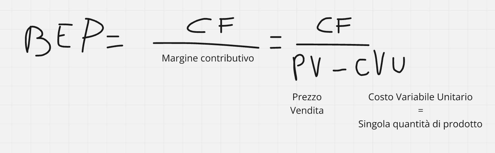
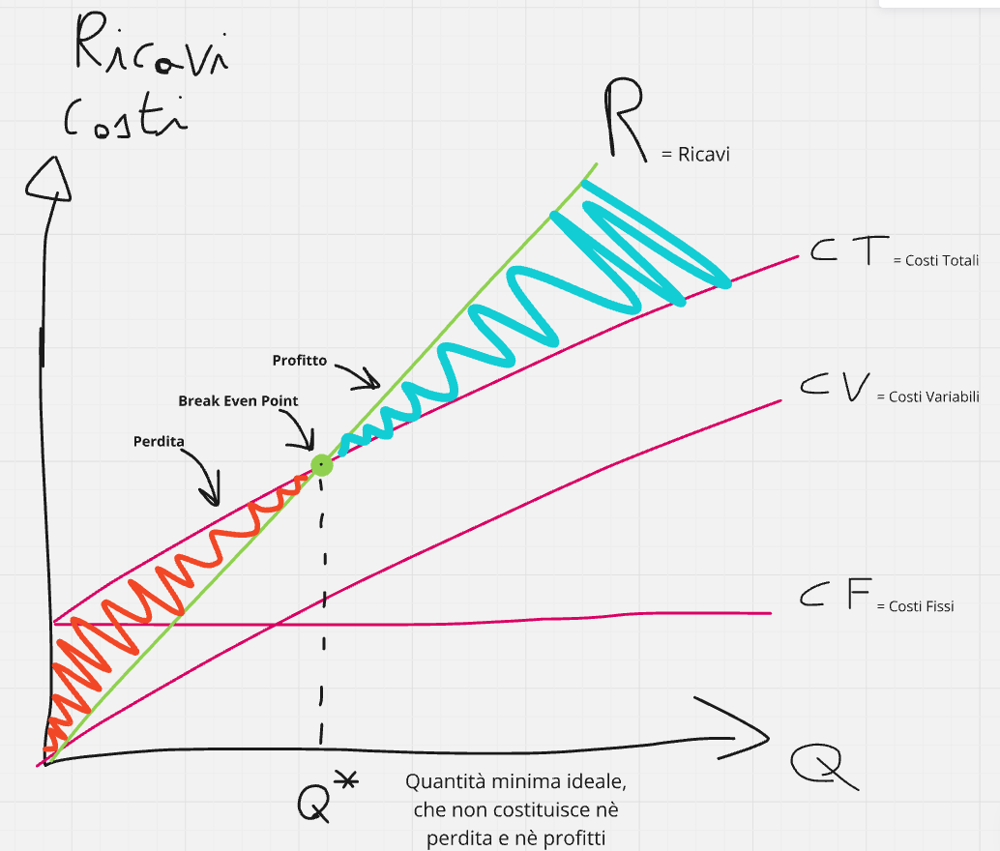

<link rel="stylesheet" href="../style.css">

# BEP (Break Even Point) *(Pag 38)*
**Il punto di pareggio** rappresenta la quantità di merce che ad una azienda conviene produrre per evitare che ci siano perdite

Il calcolo del BEP avviene attraverso 2 metodi, che sono metodo grafico (con Excel), o metodo analitico (modello matematico)

## Vantaggi del BEP: 
- aiuta nelle previsioni di vendita specificando la quantità di vendita necessaria per raggiungere una situazione di pareggio 
- aiuta nella definizione del prezzo di vendita 
- aiuta a individuare tutti i costi aziendali
- aiuta a distinguere quali sono i costi fissi e quali quelli variabili
- favorisce il controllo dell'attività produttiva
- aiuta nella definizione dell'obiettivo di guadagno e di profitto
- permette di ridurre i rischi effettuando delle azioni di monitoraggio, confronto(situazione attuale) e fare azioni correttive dove necessario.

## Svantaggi o limiti del BEP:
- è un'analisi statica, perché rappresenta la fotografia del momento in cui viene calcolato, quindi non si tiene conto delle variazioni periodiche e delle dinamiche economiche che si presentano ogni giorno
- non considera le rimanenze, ovvero non prende in considerazione gli ordini e le future vendite
- linearizzazione dei costi, in quanto prevede che i costi sono difficilmente riscontrabili in natura, in quanto sono dipendenti dalle quantità prodotte nel caso dei costi variabili
- separazione tra i costi fissi e variabili, in quanto nel tempo i costi fissi possono diventare variabili e viceversa
- non tiene conto dei mercati e quindi se l'azienda ritocca il prezzo rischia che le altre aziende concorrenti ne traggano vantaggio
- il BEP si usa:
    1. quando si avvia una nuova attività per valutare la fattibilità del progetto
    2. quando si lancia un nuovo prodotto
    3. quando l'azienda si inserisce in un nuovo canale di vendita, ovvero quando cambia targhet di vendita (il tipo di negozio, online o fisico)