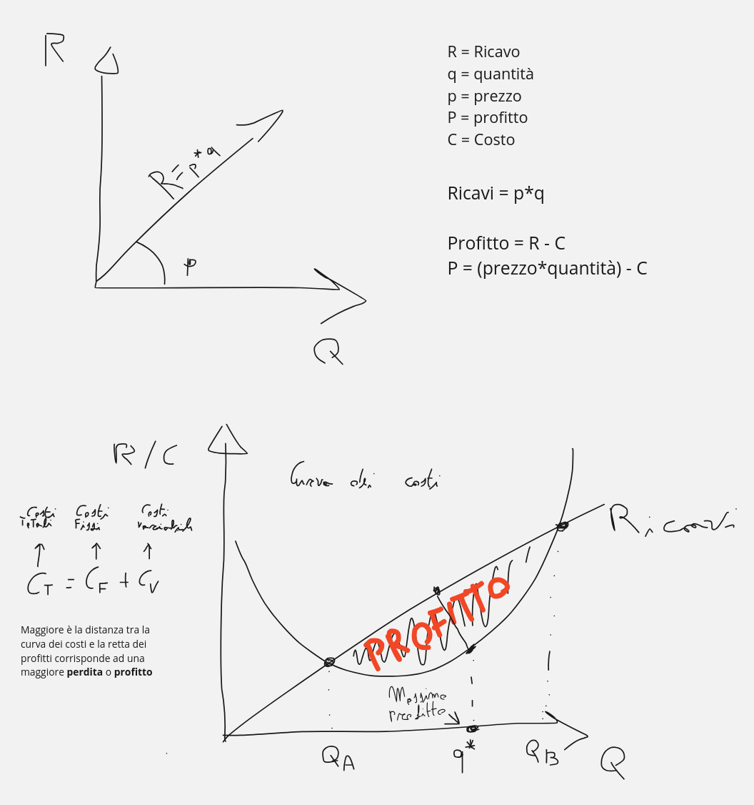

<link rel="stylesheet" href="../style.css">

# Azienda e Impresa

Le aziende sono un **insieme organizzato di persone, beni e strumenti**, e sono interconnesse a clienti e fornitori.

La famiglia, la scuola e uno studio dentistico sono esempi di azienda.

**L'impresa, invece, è l'attività svolta dall'imprenditore**.

---

## Lucro

Le aziende possono agire a scopo di lucro o senza scopo di lucro. In altre parole, possono mirare a generare un fatturato oppure a fornire beni o servizi alla società gratuitamente.

---

# Classificazione del Sistema-Azienda

Le aziende si classificano in base a tre parametri principali:

- **Profitto**,
- **Natura**,
- **Settore**.

## Profitto

### Aziende di Erogazione

Soddisfano i bisogni delle persone **esterne** all'azienda, offrendo assistenza e beneficenza.  
*Esempio: aziende no-profit*

### Aziende di Consumo

Soddisfano i bisogni delle persone **interne** all'azienda, come i dipendenti e l'azienda stessa.  
*Esempio: le famiglie*

### Aziende di Produzione

Realizzano prodotti finiti e hanno uno scopo di lucro.

---

## Natura

### Aziende Pubbliche

Hanno come soggetto giuridico un **ente pubblico**, con lo scopo di soddisfare i bisogni della collettività.

### Aziende Private

Hanno come soggetto giuridico una persona fisica o una "persona giuridica con fini privati".  
*Esempio: associazioni sportive, aziende di produzione*

---

## Settore

Le aziende possono appartenere ai seguenti settori:

- **Primario** *(Esempio: pesca, allevamento)*
- **Secondario** (settore di produzione) *(Esempio: industrie di produzione di beni)*
- **Terziario** (settore dei servizi) *(Esempio: aziende di consulenza, servizi di streaming, ecc.)*
- **Quaternario** o **Terziario Avanzato** (ICT o TIC - Informatica)

---

# Bisogni

## Bisogni Economici

Sono bisogni disponibili in **quantità limitata**, come vestirsi, mangiare, avere una casa e viaggiare.

## Bisogni Non Economici

Sono bisogni disponibili in **quantità non limitata**, come andare in bagno e respirare.

---

# L'Attività Economica

L'attività economica è l'insieme di tutte le operazioni che l'uomo compie per soddisfare i propri bisogni. Le quattro fasi dell'attività economica sono:

- **Produzione**: la combinazione dei fattori produttivi per ottenere beni o servizi.
- **Consumo**: l'utilizzo delle risorse (beni e servizi) per soddisfare i propri bisogni.
- **Risparmio**: la rinuncia a un consumo immediato per far fronte a un consumo futuro.
- **Investimento**: l'impiego di quanto risparmiato.

---

## Codice ATECO *(pag. 9)*
Fornisce una classificazione in base al tipo di attività economica che viene effettuata.
È composta da una struttura gerarchica a 6 livelli che indicano:
- le sezioni,
- le divisioni,
- i gruppi, 
- le classi, 
- le categorie, 
- le sotto categorie.

---

## Efficacia ed Efficienza
### Efficacia
È il rapporto tra gli oiettivi ottenuti e gli obiettivi attesi.

### Efficienza
È il rapporto tra i risultati conseguiti e le risorse impiegate.

---

## Costi aziendali

È un onere(spesa) che viene sostenuta per acquistare un prodotto o usufruire di un servizio, in un'azienda l'obiettivo è quello di produrre un **profitto**.

### Profitto
Il profitto si ottiene tra la differenza dei ricavi e dei costi
```
Profitto = ricavi - costi
```

### Ricavo
Il ricavo è il guadagno ottenuto dalla vendita dei propri prodotti o servizi, si ottiene moltiplicando la quantità dei prodotti e il prezzo di vendita.
```
Prezzo * quantità
```

### Costo
I costi si classificano in:
- costi di prodotto, sono quei costi per la realizzazione di un prodotto o servizio e comprendono:
    - **costi diretti:**
        - i costi di lavoro diretto, (Es: addetto alla produzione)
        - i costi di materiali diretti, (Es: acquisto materie prime, semi lavorati, e componenti vari )
    - **costi indiretti:**
        - di produzione, (Es: costi fissi, indipendentemente dal tipo di attività, corrente, acqua, ecc..)
    - **costi di periodo:**
        - tutte le attività che non sono associabili alla realizzazione del prodotto o servizio:
            - i costi di ricerca e sviluppo
            - le spese amministrative
            - gli stipendi


    - **Costi fissi (Non evitabili):**
        - Non variano in base alla quantità prodotta, (Es: affitto del locale, gli stipendi, le bollette)
    - **Costi variabili (Evitabili):**
        - Non sono fondamentali per l'azienda e si possono moderare, possono variare in base alla quantità prodotta, (Es: costi relativi alle materie prime, costi di trasporto, costi di vendita, pubblicità, ecc..)


