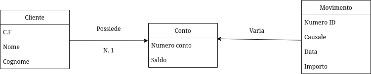

<link rel="stylesheet" href="../style.css">

<label style="" for="tema-scuro">Tema scuro
    <input type="checkbox" id="tema-scuro"></input>
</label>

_pag 29 libro_

Con i DB modelliamo la realtà che ci circonta
Correlazione e vincoli dei dati

Modello dei dati sono classificati in base al livello di generalità (dal più astratto al meno astratto):

1. Modello concettuale (a oggetti)
2. Modello logico (di record)
3. Modello fisico (di blocchi)

## Modello concettuale

Il progetto è indipendente dal pc che si usa (windows/linux), dai supporti fisici (hdd/ssd), e dal dbms (mysql/postgresql).

Questo modo di operare consente al DB di svilupparsi col tempo per l'azienda per cui è stata creata.

Tra i numerosi modelli proposti (progettazione concettuale), il più famoso è entità-relazioni (modello ER, Entity Relationship), gli oggetti hanno il nome di entità, si identificano gli attributi che rappresentano le caratteristiche delle entità e le relazioni tra le entità

## Modello logico

Possiamo andare a progettare un database tramite il modello logico, cioè le strutture che organizzano i dati.
Ci sono 3 differenti modelli logici:

-   gerarchico (con puntatori diretti alla memoria), **datato**
-   reticolare (con puntatori diretti alla memoria), **datato**
-   relazionale (basato su valori)

## Modello fisico

[Pagina editing modelli DB](https://app.diagrams.net/?src=about#G1WzwBWvY8X0pON42iIPLclcSq2dSwiEIR#{"pageId"%3A"cDxCdpYFD2NNhVUvpleY"})

---

# Modello Entità-Relazione: Cliente-Conto-Movimento

## Algebra relazionale:

-   Cos'è una chiave:

    -   primaria
    -   esterna

-   vincoli di integrità

---

# Schema di progettazione di un database _01/10/2024_

## 1. Studio di fattibilità

## 2. Analisi dei requisiti (entità, attributi, relazioni)

### Entità

Sono come le classi nella programmazione ad oggetti, rappresentano una categoria di oggetti
Hanno proprietà comuni, hanno esistenza autonoma, sono di interesse per l'applicazione

Le rappresentiamo con un rettangolo con al centro scritto il nome dell'entità stessa.

### Attributi

Sono caratterizzati da:

-   nome
-   formato (es: varchar(10))
-   dimensione
-   valore

### Attributo chiave

CHiave candidata o superchiave, un attributo o un insieme di attributo

Es di attributi:

-   nome
-   luogo di nascità
-   età

## 3. Progettazione concettuale (Schema ER)

Scritta in UML, organizza i dati

## 3. Progettazione Logico-fisica (schema logico)

## 5. Implementazione del database

## 6. Messa in opera

# Sinonimi:

-   classe/entità
-   colonne/campi
-   righe/record
