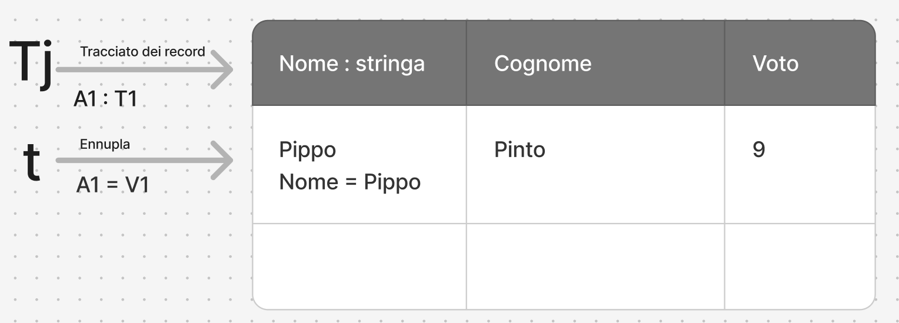
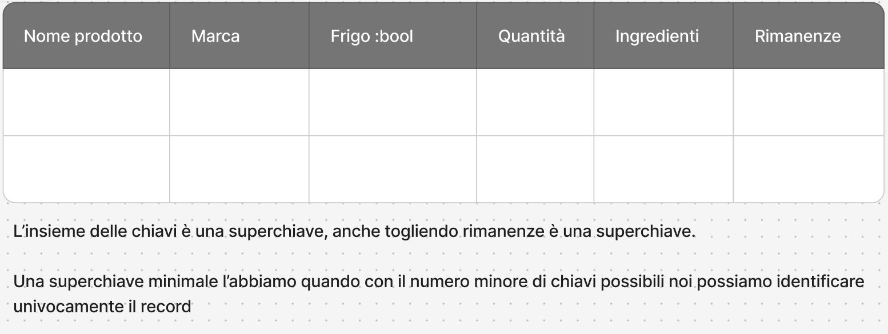

Tabella = schema relazione (insieme di tuple)

DB = schema relazionale (insieme di tabelle o schemi relazione)

---

# Def 1: Schema relazione

## R:{T} (Tabella, insieme di tuple)

Lo schema relaziona + una coppia formata da un nome di relazione R e da un "tipo di relazione" definito così:

-   sono tipi primitivi (interi, reali, booleani e stringhe)
-   se T1, ..., Tn sono tipi primitivi a A1, ..., An sono etichette => (A1:T1, ..., An:Tn) è un tipo ennupla di grado n
-   se T è un tipo Ennupla, => {T} è un tipo di insieme ennuple

ennupla: è una tupla con n elementi al suo interno

Es:

```
- T1 : int              - A1 : id
- T2 : string           - A2 : nome
- T3 : string           - A3 : cognome

```

---

# Def 2: Schema relazionale

## Ri:{Ti}; i = 1, ..., k (DB, insieme di tabelle)

Uno schema relazionale è costituito da un insieme di schemi di relazione e da un insieme di vincoli di integrità (sono possibili su valori associati alle relazioni)

---

# Def 3: Ennuple (righe della tabella)

Una ennupla t di Tj (tracciato dei campi) di coppie (Ai, Vi)
La cardinalità di una relazione è il numero delle sue ennuple.

```
t = (A1=V1, ... , An=Vn) (Assegnazioni Etichetta-Valore si fanno con =)
Tj = (A1:T1, ... , An:Tn) (Associazioni Etichetta-Tipo si fanno con :)
```



---

# Def 4: 3 Importanti vincoli da definire

1. Quali attributi non possono assumere un valore nullo
2. Quali attributi sono chiavi
3. Quali attributi sono chiavi esterne

#### Un istanza r di uno schema di relazione R è valida se rispetta tutti i vincoli definiti su R.

# Def 5: Una superchiave

Una superchiave di uno schema di relazione è un insieme "X" di attributi tale che in ogni istanza valida dello schema di relazione.
I valori degli attributi in X individuino univocamente una ennupla.

# Def 6: Una chiave

Una chiave di uno schema di relazione è una superchiave minimale, nel senso che se si elimina un attributo, i rimanenti **non formano più** una superchiave.
Un attributo che ∈ (appartiene) ad una chiave k è detto attributo primo.


# Def 7:

## interità e consistenza

Integrità: quando la transazione eseguita non compromette il dato, nel senso che non viola i vincoli dello schema relazione

consistenza: quando il dato è valido, ovvero che il suo valore corrisponde alla realtà

```
Appunti compito
## ciclo di vita
- Trovare i bisogni degli utenti
- identificare i requisiti
- progettazione concettuale
- realizzazione del sistema logico e fisico


monitoraggio e controllo
```

# Def 8: Chiave esterna

Un insieme di attrivuti A1, ..., An di uno schema di relazione B è una chiave esterna, che riferisce una chiave primaria B1, ..., Bn, di uno schema di relazione S, se in ogni istanza valida della base di dati,, per ogni ennupla t, dell'istanta di R esiste un'ennupla t, "diferita da tr", ovvero tale che, per ogni i appartenente a 1...n, tr.Ai=Ts.Bi, dove t.A indica il valore dell'attributo A dell'ennupla t.
