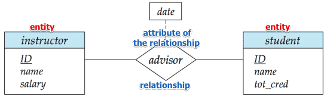

*pag 29 libro*

Con i DB modelliamo la realtà che ci circonta
Correlazione e vincoli dei dati

Modello dei dati sono classificati in base al livello di generalità (dal più astratto al meno astratto):
1. Modello concettuale (a oggetti)
2. Modello logico (di record)
3. Modello fisico (di blocchi)

Il progetto è indipendente dal pc che si usa (windows/linux), dai supporti fisici (hdd/ssd), e dal dbms (mysql/postgresql).

Questo modo di operare consente al DB di svilupparsi col tempo per l'azienda per cui è stata creata.

Tra i numerosi modelli proposti (progettazione concettuale), il più famoso è entità-relazioni (modello ER, Entity Relationship), gli oggetti hanno il nome di entità, si identificano gli attributi che rappresentano le caratteristiche delle entità e le relazioni tra le entità

Cliente-conto-movimento

# Modello Entità-Relazione: Cliente-Conto-Movimento
