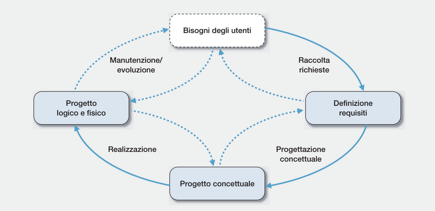

<link rel="stylesheet" href="../style.css">

# Utenti DBMS:

-   chi progetta i DBMS
-   chi li installa e mantiene performanti e sicuri
-   chi progetta il DB
-   chi usa il DB per il programma che sta sviluppando
-   chi fa uso (come utente non programmatore) di software che si affidano ai DBMS

---

# SQL:

Structured Query Language, composto da:

-   DDL (Data Definition Language), permette di definire la struttura del DB
-   DML (Data Manipulation Language), permette di modificare i dati contenuti nel DB
-   QL (Query Language), permette di eseguire operazioni di ricerca sui dati contenuti nel DB

---

# Gestori

Offrono un livello di astrazione dei dati ai livelli superiori, spesso le loro operazioni sono ridontanti, permettono di garantire l'integrità dei dati e prestazioni migliori

## Gestore memoria permanente

Organizzazione dei dati come pagine fisiche di grandezza prefissata, permette di vedere i dati come pagine anziché blocchi fisici

## Gestore buffer

Raccoglie in ram più pagine e le restituisce al gestore della memoria permanente, così da ridurre i tempi di attesa da parte dell'accesso allo storage

## Gestore strutture di memorizzazione

Fornisce ai livelli superiori i dati organizzati come collezioni di record e tabelle

## Gestore metodi di accesso

Riordina i dati nell'ordine in cui sono stati memorizzati o in base all'indice

## Gestore affidabilità

Si occupa di tenere sincronizzati i dati dello storage con le ultime modifiche avvenute ai file in RAM

## Gestore della concorrenza

Si occupa di bloccare gli accessi concorrenti ai dati

---

# Definizioni

## Schema relazione

Uno schema relazione **R : {T}**, corrisponde ad una **coppia**, formata da un **nome della relazione** e da un **tipo relazione**

### Tipi di relazione

-   tipo primitivo, quando è un singolo valore fatto e finito, di tipo:
    -   intero
    -   reale
    -   booleano
    -   stringa
-   elenco di attributi, che formano la n-upla:

    -   **$T_{1}$**, ..., **$T_{n}$**, dove gli attributi sono espressi come: (**$A_{1} : T_{1}$**, ..., **$A_{n} : T_{n}$**)

### Grado della relazione

Il numero di colonne della relazione corrisponde al grado della relazione

## Schema relazionale

Uno schema relazione **$R_{i}$ : {$T_{i}$} , $i = 0, ..., i = k$**, è un insieme di schemi di relazione, e un insieme di vincoli di integrità, quali:

-   la chiave primaria che non può essere nulla
-   quali attributi sono chiavi
-   quali attributi sono chiavi esterne

## Superchiave

Una superchiave in uno schema relazione è l'insieme di di attributi che permettono di distinguere le ennuple contenute in esso, non possono essere rimossi ulteriori attributi.

## Superchiave minimale

Una superchiave si dice minimale se per esprimere il suo valore non possono essere rimossi ulteriori attributi: - esempio: la **data**, è caratterizzata da **giorno, mese e anno**

## Chiave primaria

È la chiave che:

-   non può avere valore nullo
-   è un identificatore univoco per l'n-upla
-   negli schemi di relazione del modello logico, si identificano con una sottolineatura

## Ennupla

Un ennupla
**t = ( $A_{1}$ = $V_{1}$, ... , $A_{n}$ = $V_{n}$ )**, di tipo **$T_{j}$ = ($A_{1} : T_{1}$, ..., $A_{n} : T_{n}$)** è un insieme di coppie ($A_{i}$, $V_{i}$), con $V_{i}$ di tipo $T_{i}$

`La cardinalità di uno schema di relazione è il suo numero di ennuple`

`Il suo grado è il suo numero di attributi`

---

# Ciclo di vita di un software

---

# Transazione
