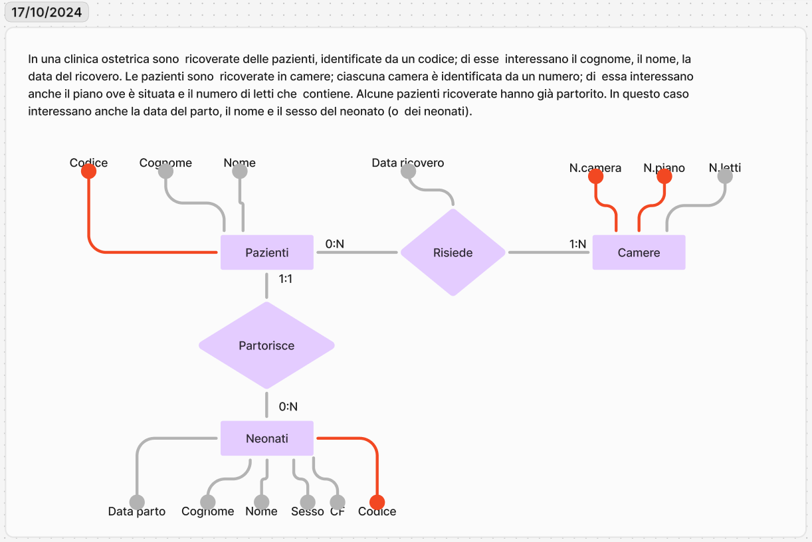

<link rel="stylesheet" href="../style.css">

# Generalizzazione

**Totale:** Una persona deve avere (almeno) un ruolo _(deve essere per forza istanza di una sotto entità)_ 
**Parziale:** Una persona può non avere ruoli _(può non essere istanza di una sotto entità)_

**Esclusiva:** una persona deve avere **solo un ruolo** 
**Inclusiva:** una persona può avere **più ruoli**

Quando lo schema **non specifica la generalizzazione**, possiamo intendere che sia di tipo **Totale-Esclusivo**.

---

# Specializzazione

---

# Differenza tra generalizzazione e specializzazione
