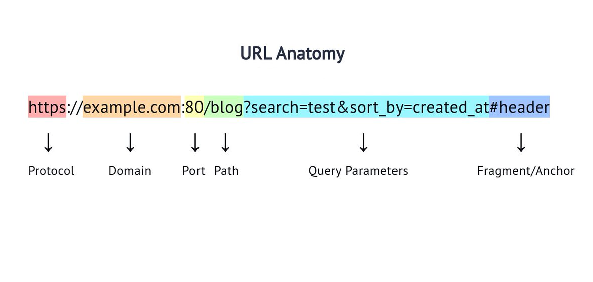

<link rel="stylesheet" href="../style.css">

# HTTP (Hypertext Transfer Protocol)

L'**HTTP** è un protocollo di trasferimento ipertestuale che opera a livello applicativo. È il "linguaggio" utilizzato da browser e server per scambiarsi informazioni.

## Origini del WWW

Il **World Wide Web (WWW)** è nato dall'insieme di diverse tipologie di risorse. Le principali sono:

-   **HTML** (HyperText Markup Language)
-   **URL** (Uniform Resource Locator)
-   **HTTP** (Hypertext Transfer Protocol)

## Trasmissione delle risorse

L'HTTP viene utilizzato per trasmettere risorse, non solo file. Alcuni termini importanti da conoscere sono:

### W3C (World Wide Web Consortium)

Un'organizzazione che sviluppa standard per il web.

### URI (Uniform Resource Identifier)

Un identificatore generico per una risorsa su una rete. Può essere un nome o un indirizzo completo. Le categorie principali di URI includono:

-   **URN (Uniform Resource Name)**: identifica una risorsa attraverso un nome univoco, ad esempio: _urn:isbn:978-3-16-148410-0_ (il codice di un libro, senza informazioni sul dove trovarlo).
-   **URL (Uniform Resource Locator)**: è un identificatore per un indirizzo preciso, che include il protocollo (es. _http://_, _https://_) e l'indirizzo della risorsa (es. *www.google.com*).

## Versioni di HTTP

Le principali versioni dell'HTTP sono:

-   **HTTP/1.0** (1996)
-   **HTTP/1.1** (1997, aggiornato nel 1999)
-   **HTTP/2.0** (2015)

La versione **1.1** permette di specificare una **connessione permanente** e consente il criptaggio di alcuni dati. Con **connessione permanente** si intende che una richiesta e la risposta avvengono all'interno della stessa connessione, grazie al server che mantiene aperta la connessione TCP dopo aver inviato la risposta.

# HTTP e il modello Client/Server

La versione **2.0** introduce diverse funzionalità innovative:

### 1. Multiplexing

-   **HTTP/2** consente l'invio simultaneo di molteplici richieste e risposte su una singola connessione TCP.

### 2. Compressione degli Header

-   Gli header ridondanti vengono compressi, riducendo il carico sulla rete e migliorando le prestazioni.

### 3. Server Push

-   Il server può inviare proattivamente al client risorse previste per l'uso (ad esempio, file CSS, immagini, JavaScript) senza che il client le richieda esplicitamente.



# Il protocollo HTTP

Il protocollo HTTP per comunicare utilizza le sessioni, che funzionano secondo il seguente ordine:

1. **Il client**
    1. Inizia stabilendo una connessione TCP con il server
    2. sceglie la porta tramite cui comunicare _(la porta ":80" viene usata di default)_
    3. effettua una richiesta _(request)_ in formato HTTP come testo contenente un URL
2. **Il server**:
    1. produce il file di risposta e lo invia _(response)_
    2. chiude la connessione TCP


---

# Tipi di connessione

Esistono due tipi di connesione permanente:

-   ### Connessione permanente **incanalata**
    -   **Invia tutte le risposte subito** seguendo una coda chiamata **pipeline**, che segue lo stesso ordine delle domande ricevute
-   ### Connessione permanente **non incanalata**
    -   **Aspetta la conferma della ricezione di una risposta** prima di inviare la risposta successiva.

# Struttura messaggio HTTP

Il protocollo HTTP utilizza il formato ASCII per la codifica dei testi.

## Prima riga

Contiene la versione HTTP usata dal client oppure lo status code della response nel caso del server

## header

L'header è caratterizzato dalla presenza di diversi valori rappresentati con il formato:

```
chiave : valore
```

ESEMPIO:

```http
HTTP/1.1 200 OK
Content-Type: text/html
Content-Length: 6
user-agent: Mozilla/5.0
```

**Ogni riga è un header diverso.**

-   user agent (indica versione browser del client)
-   host (indica l'host del server, Es: www.google.com)
-   mime type (multipurpose internet mail extensions), è il tipo di contenuto del messaggio HTTP e indica al client come interpretare i dati ricevuti dal server.

### CRLF

A separare le righe ci sono i CRLF (Carriage Return Line Feed)

_<strong>Carriage return</strong> ("inizio riga")_, indica al puntatore di tornare all'inizio della riga
<br>
_<strong>Line feed</strong> ("nuova riga")_, indica al puntatore di andare alla riga successiva

### Metodi HTTP

Metodo: get, post, put , delete

ESEMPIO richiesta HTTP GET:

```http
GET /percorso/file.html HTTP/1.1
```

## Riga vuota

È una riga usata per separare gli Header e il Body.

## Body

Corpo del messaggio contiene i dati trasportati dal client al server

## Chiarimenti

Corpo e header sono facoltativi

# Request e response

## Request

Una HTTP request è un messaggio testuale inviato dal client al server HTTP ed è formato da tre elementi:

-   riga di richiesta
-   intestazione HTTP (header)
-   corpo del messaggio (body)

```XML
<Method> <URI ><Version>    <!-- riga di richiesta -->
[Header]                    <!-- Intestazione HTTP -->
CRLF                        <!-- Riga vuota -->
[Body]                      <!-- Corpo del messaggio -->
```

### Esempio di richiesta HTTP

## Response

È organizzata in maniera analoga rispetto a una richiesta.

Si differenzia dalla richiesta per la presenza dello stato della richiesta nella prima riga.
Esempio :

```XML
HTTP/1.1 <Status Code> <Reason Phrase>
[Header]                    <!-- Facoltativo-->
CRLF                        <!-- Riga vuota -->
[Body]                      <!-- Facoltativo -->
```

---

# Metodi (Verbi) HTTP

Nella comunicazione HTTP, la prima riga di intestazione di una **request** contiene un elemento chiamato metodo o verbo HTTP.

I più importanti usati nelle applicazioni web con RESTFUL API sono: GET, POST, PUT, DELETE.

Le API sono

Operazioni CRUD (Create, Read, Update, Delete), vengono gestite ad esempio in questo modo;

-   chiedere dati al server, il client inivia una richiesta GET ad un API di tipo READ
-   creare dati, il client invia una richiesta POST ad un API di tipo CREATE
-   modificare dati, il client invia una richiesta PUT ad un API di tipo UPDATE
-   rimuovere dati, il client invia una richiesta DELETE ad un API di tipo DELETE

I codici di stato sono definiti dall'Internet Engineering Task Force (IETF)

-   100-199 informazioni sullo stato della richiesta
-   200- 299 successful
-   300-399 redirection
-   400-499 client error
-   500-599 server error
