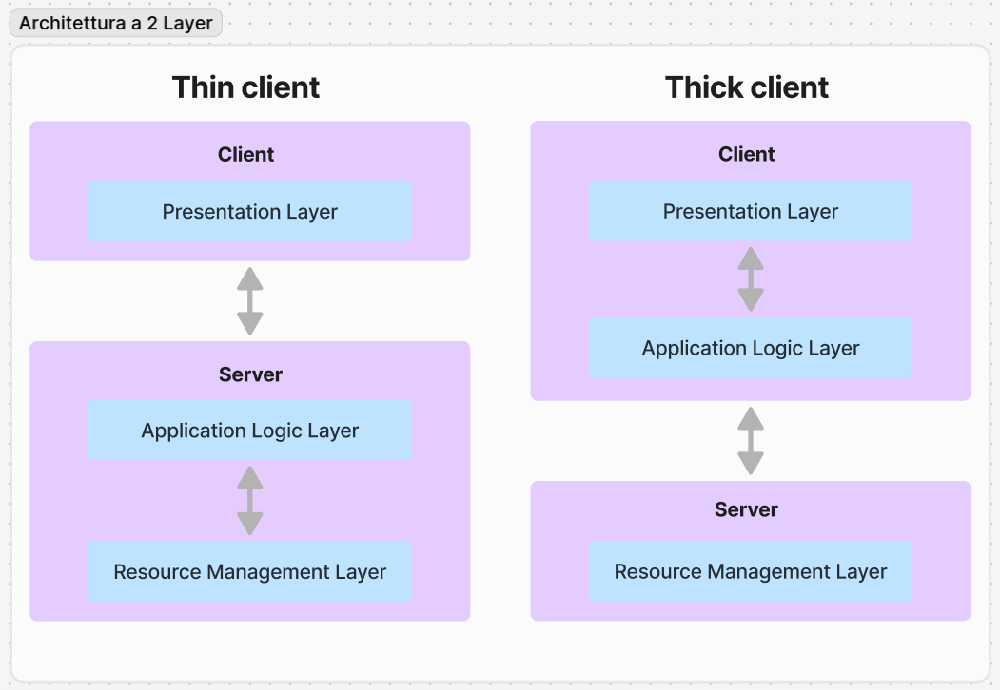

<link rel="stylesheet" href="../style.css">

# Tecnologie del web
Possiamo distinguere le tecnologie del We in **due gruppi**, in base al posto in cui avvengono le eleaborazioni.

- Possiamo schematire la comunicazione client-server in tre fasi dell'elaborazione
    - Invio Request
    - Elaborazione della response
    - Invio Response

## 1. Tecnologie client side
Sono strutture tecnologiche in cui l'elaborazione avviene sul cliente, tipicamente nel browser.
- le pagine che usano soltanto tecnologie client side possono funzionare senza un web server, aprendo la pagina sul proprio browser con il path sul file system
- se la pagina web non necessita di elaborazione lato server, allora il codice sorgente della pagina sarà in chiaro per l'utente
- le parti di codice che utilizzano tecnologie client side sono fisibili e i linguaggi utilizzati sono html e javascript

## 2. Tecnologie server side
Sono strutture tecnologiche in cui l'elaborazione avviene sul server, tipicamente nel web server.

Esempi di tecnologie server side: PHP e Java servlet.

Elaborano il codice della pagina e la restituiscono agli utenti che la richiedono tramite un URL.

---

# Modello client-server
È costituito da **host**, che gestiscono le risorse:
- **client**, che richiedono le risorse
- **server**, che elaborano le risorse

Non sono gli host ad essere server o client, ma i processi che sono in esecuzione su di essi.

Per processo di intende un programma in esecuzione, su un host possono essere eseguiti diversi processi, che gestiscono le risorse.

**Un host può essere contemporaneamente sia server che client.**

---

- Programma chiamato client richiede servizi ad un altro programma chiamato server
- Quest'ultimo è ospitato su un computer chiamato host, che ascolta le richeste tramite un socket su una determinata porta, in attesa di richieste future dai client
- il client usando il protocollo TCP/IP invia la richiesta al server tentando la connessione sopra la porta associata al socket del server 

---

# Comunicazione unicast e multicast
## Unicast
Il server comunica con un solo client alla volta e non accetta altre connessioni da altri client.

## Multicast
Il server può comunicare con molteplici client contemporaneamente.

I client si connettono prima all'80 e poi spostano la loro connessione sulla prima porta successiva libera, lasciando sempre la porta 80 libera.

Simulazione di connessione multicast:
- client-1 si connette alla porta 80 e dopo si sposta sulla 81
- client-2 si connette alla porta 80 e dopo si sposta sulla 82
- client-3 si connette alla porta 80 e dopo si sposta sulla 83

# Livelli e strati
Le architetture client-server sono solitamente organizzate in 3 livelli o strati:
- frontend (presentation tier). è l'interfaccia utente
- logica applicativa (middle tier)
- backend (data tier), ha accesso alle risorse e dati

## Presentation layer (frontend)
Si occupa, attraverso procedure e moduli. di mostrare all'utente le pagine HTML, i contenuti ricavati dal server e di comunicare con quest'ultimo, ad esempio attravero i form. 

## Resource Management Layer (RML) / Data Access Layer (DAL)
È composto dall'insieme delle procedure che gestiscono i dati, cioè memorizzano e recuperano le informazioni persistenti dagli archivi di massa delle basi di dati, Nel caso in cui esso è implementato tramite un DBMS, è detto semplicemente Data Access Layer (DAL).

## Business Logic Layer o Resource Management Layer
È il corpo centrale dell'applicazione che comprende la logica della elaborazione e le definizione delle relazioni esistenti tra le diverse entità,
Per esempio, comprende l'algoritmo che implementa le operazioni legate a un prelievo su un conto corrente bancario, o la sequenza di passi da compiere per effettuare un acquisto online.

# Architettura a 1 livello - 1 tier

# Architettura a due livelli - 2 tier
Il modello *thin-client*:
- il server è responsabile della logica applicativa e gestione dei dati
- il client è responsabile della esecuzione del software presentazione

Il modello *thick-client*:
- il server è responsabile gestione dei dati
- il client è responsabile della logica applicativa e presentazione

## Svantaggi
- il limite delle architetture client/server a due livelli è che sono poco scalabili
- il server deve gestire la connesione e lo stato della sessione di ciascun client, questo carico di elaborazione porta alla limitazione del numero limitato di client che possono essere gestiti contemporaneamente.

# Architettura a tre livelli - 3 tier
A partire dagli anni Novanta, l'architettura client-server è a 3 livelli. Ogni livello corrisponde ad uno strato architetturale:
- frontend o presentaion layer: è l'interfaccia utente
- logica applicativa o middle tier
- backend con l'accesso alle risorse/ai dati, anche detto data tier (resource tier)

I vantaggi dell'introduzione del middleware sono notevoli, soprattutto in termini di **prestazioni**, in quanto in questo modo si favorisce la distribuzione della quantità di elaborazione a scapito della latenza.

Inoltre il sistema è facilmente scalabile in quanto all'aumentare delle richieste di un servizio è possibile aggiungere qualche server in grado di compensare il carico di lavoro ed è inoltre più tollerante ai guasti.

Anche in termini di sicurezza il modello a tre livelli porta notevoli vantaggi in quanto rende possibile l'introduzione di sicurezza a livello di servizio e quindi più facilmente gestibile.

Nei sistemi a 3 tier è però più difficile la loro progettazione, lo sviluppo e l'amministrazione. 

## Architetture a N tier
Sono delle generalizzazioni del modello a 3 strati, che introducono layer in più
