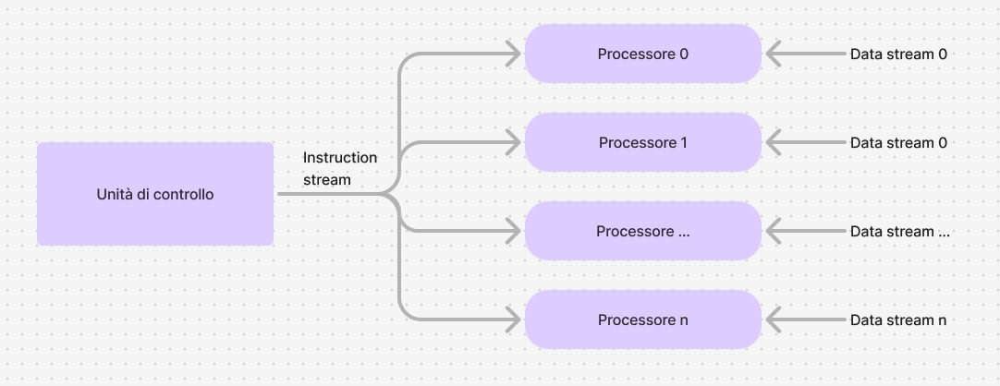
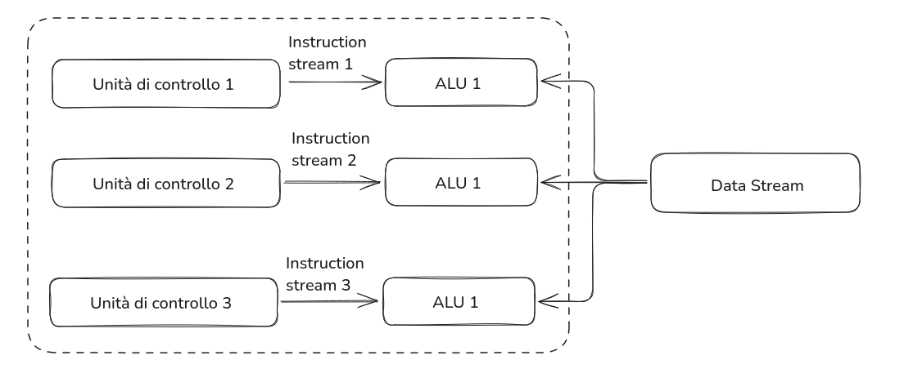

<link rel="stylesheet" href="../style.css">

<label style="position:static;" for="tema-scuro">Tema scuro
<input type="checkbox" id="tema-scuro"></input>
</label>

# I sistemi centralizzati

Un sistema informatico è centralizzato quando dati e applcazioni risiedono in un unico nodo elaborativo.

# I sistemi distribuiti

Un **sistema informatico** si dice **ditribuito** se almeno una delle seguenti due condizioni è verificata:

- **elaborazione distribuita**: le applicazioni risiedono su più host che collaborano tra loro
- **base di dati distribuita**: il patrimonio informativo è ospitato su più host

Un sistema distribuito è costituito da un inseme di applicazioni logicamente indipendenti che collaborano per il perseguimento di obiettivi comuni attraverso una infrastruttura di comunicazione hardware e software.

## Caratteristiche principali

- **Distribuzione geografica:** i nodi possono trovarsi in luoghi diversi.
- **Comunicazione via rete:** i nodi comunicano attraverso una rete
- **Condivisione delle risorse:** più dispositivi possono usare le stesse risorse (file, database, potenza di calcolo)
- **Scalabilità:** possono essere ampliati agiungendo nuovi nodi senza compromettere il funzionamento.

## Classificazione dei sistemi distribuiti

È possibile classificare i sistemi distribuiti in tre grandi famiglie:

- sistemi di calcolo distribuiti
- sistemi informativi distribuiti
- sistemi distribuiti pervasivi

### I sistemi di calcolo distribuiti

Sono generalmente configurati per il calcolo ad alte prestazioni, di cui vediamo 2 configurazioni:

- cluster computing
- grid computing.

### I sistemi informativi distribuiti

Tra i sistemi informativi distribuiti si ha:

- il web, che risulta essere il più grande sistema distribuito
- le nuove tecnologie mobile hanno accelerato l'evoluzione dei sistemi informativi tradizionali, che integrando sistemi legacy, con nuove tecnologie di comunicazione, hanno generato i moderni sistemi informativi.

_Sistemi legacy: vecchi sistemi informatici ancora in uso perchè svolono funzioni critiche per un'organizzazione, ma che non sono più aggiornati o supportati con tecnologie moderne_.

### I sistemi distribuiti pervasivi

Sono una nuova generazione di sistemi che anno tipicamente connessioni di rete wireless.

Generalmente sono sottoparti di sistemi più grandi, tra essi rientrano:

- i sistemi domestici, _es: Amazon Alexa_
- le Personal Area Network o **PAN**, _es: Sanità digitale e Bluetooth_
- le wearable computing _es: smartwatch e fitness tracker_
- le reti di sensori _es: Smart City, semafori intelligenti con sensori per il traffico e inquinamento_

## Benefici della distribuzione

### Affidabilita

Grazie alla sua ridondanza intrinseca un SD _(sistema distribuito)_ è in grado di "sopravvivere" a un guasto di un suo componente

### Integrazione

Integrare componenti spesso eterogenei tra loro, sia per tipologia hardware (da PC a mainframe, da smartphone a tablet), sia per sistema operativo

### Trasparenza

L'utente non deve accorgersi che sta interagendo con un sistema distribuito ma deve avere la percezione di utilizzare un singolo elaboratore, senza percepire eventuali mutamenti che si verificano nel tempo nel sistema.

### Economicità

I SD offrono un miglior rapporto qualità/prezzo rispetto ai sistemi centralizzati basati su mainframe.
Una rete di PC connessi costa molto meno di un mainframe, ma oggi ha una capacità di computazione simile.
Inoltre, permettono di integrare facilmente i sistemi legacy, evitando di abbandonare investimenti già fatti e consentendo la convivenza con tecnologie più moderne.

### Flessibilità

Possono essere progettati per adattarsi a diverse esigenze e configurazioni hardware/software.

### Connettività e collaborazione

Possibilità di condividere risorse hardware e software comporta vantaggi economici. Per esempio è pessibile condividere apparecchiature speciali di costo elevato.

### Prestazioni e scalabilità

La crescita di un sistema distribuito con l'aggiunta di nuove risorse e, quindi, di nuovi servizi, fornisce a tutti i suoi componenti un miglioramento delle prestazioni e permette di sostenere l'aumento del carico di richieste.

### Tolleranza ai guasti

La possibilità di replicare risorse offre una certa garanzia di tolleranza ai guasti.

## Svantaggi legati alla distribuzione

### Produzione di software

I programmatori hanno dovuto modificare il proprio stile di programmazione e aggiornarsi con lo studio dei nuovi linguaggi e dei nuovi strumenti di sviluppo per poter realizzare applicazioni distribuite.

### Complessità

Proprio per la struttura hardware i sistemi distribuiti sono più complessi di quelli centralizzati.

### Sicurezza

Nascono nuove problematiche connesse alla sicurezza che nel caso di sistemi centralizzati erano inesistenti

### Comunicazione

La mancanza di prevedibilità delle richieste genera situazioni "casuali" di carico e quindi di risposta del sistema che possono essere molto diverse anche a breve distanza di tempo.

## Architetture distribuite hardware: dalle SISD al cluster di PC

Esistono diverse possibilità per classificare le architetture hardware a seconda dei fattori che si prendono come riferimento.

Noi ricordiamo quella di **Flynn** (1972) che si basa sui due flussi di informazioni normalmente presenti nei calcolatori:

- flusso delle istruzioni
- flusso dei dati

A seconda di come si "combinano" i flussi di dati e di istruzioni abbiamo quattro possibili situazioni:

|                    | Dati singoli | Dati multipli |
| ------------------- | ------------ | ------------- |
| Istruzioni singole  | SISD         | SIMD          |
| Istruzioni multiple | MISD         | MIMD          |

### SISD
Macchine _Single Instruction Single Data_, flusso di istruzioni unico e flusso di dati unico

### SIMD
Macchine _Single Instruction Multiple Data_, flusso di istruzioni unico e flusso di dati multiplo

### MISD
Macchine _Multiple Instruction Single Data_, flusso di istruzioni multiplo e flusso di dati unico

### MIMD
Macchine _Multiple Instruction Multiple Data_, flusso di istruzioni multiplo e flusso di dati multiplo

---

### SISD
Un elaboratore come la macchina di Von Neumann che ha un solo flusso di dati e un solo flusso di istruzioni

Nelle macchine a singola CPU il flusso di istruzioni è unico e quindi viene eseguito un solo programma alla volta 

Dopo l'esecuzione della prima istruzione si passsa alla seconda e così via fino al termine del programma 

Le istruzioni sono quindi eseguite in modalità sequenziale

#### Cosa vuol dire
Una singola istruzione lavora su un singolo dato alla volta.

#### Analogia
Immagina un insegnante che spiega una lezione e un solo studente che ascolta e risponde.
L'insegnante da un'unica istruzione e lo studente esegue quell'istruzione su un unico compito.

### SIMD
l'elaborazione avviene su più flussi dati in contemporanea ma con un singolo flusso di istruzioni

Particolarmente adatto per realizzare calcoli vettoriali e matriciali sopratutto in ambiente grafico

#### Cosa vuol dire
Una singola istruzione viene eseguita contemporaneamente su tanti dati diversi.

#### Analogia
Pensa a un insegnate che da la stessa istruzione a tutta la classe.
Tutti gli studenti (ognuno col proprio quaderno) eseguono esattamente lo stesso compito contemporaneamente.
Ad esempio, se l'insegnante chede di sommare due numeri, tutti gli studenti fanno la stessa operazione, ognuno con numeri diversi.

### MISD
Elaboratori che eseguono più istruzioni sullo stesso flusso di dati

Con questa tipologia di architettura a oggi non sono ancora state costruite macchine da commercializzare, anche se il modello ricorda la modalità di esecuzione delle istruzioni in pipeline.

#### Cosa vuol dire
Più istruzioni diverse vengono applicate allo stesso dato.

#### Analogia
Immagina di avere un singolo grande disegno da analizzare e, contemporaneamente, più insegnanti che forniscono punti di vista o domande differenti sullo stesso disegno.

### MIMD
L'architettura Multiple Instruction stream-Multiple Data stream comprende tutte le tipologie di elaboratori composti da più unitò centrali di elaborazione indipendenti che possono lavorare su stream di dati anch'essi indipendenti.

Sono ulteriormente classificate in:
- macchine MIMD a memoria fisica condivisa:
  - su mezzo condiviso
  - su canale diretto
- macchine MIMD a memoria privata:
  - su mezzo condiviso
  - su canale diretto

sono architetture a memoria condivisa (Shared memory)

La comunicazione tra processi avviene mediante variabili condivise.

È necessario implementare gli opportuni meccanismi di sincronizzazione per regolare gli accesi alla memoria in modo da coordinare i diversi processi per gestire la competizione alle risorse comuni.

---

## Cluster computing
Un sistema distribuito costituito da un insieme di nodi ad alte prestazioni interconnessi tramite una rete locale ad alta velocità

Devono essere omogenei, cioè i singoli nodi hanno lo stesso sistema operativo, hardware molto simile, e sono connessi attraverso la stessa rete.

## Grid computing
È un sistema distribuito di calcollo altamente decentralizzato.

È composto da un grande numero di nodi disposti a griglia e caratterizzati da un grado elevato di eterogeneità, sia per hardware, che per software, la tecnologia di rete, le politiche di sicurezza ecc.

## Sistemi distribuiti pervasivi
Questa è una nuova generazione di SD, i cui nodi sono piccoli, mobili con connessioni di rete wireless e spesso facenti parte di un sistema più grande:
- sistemi domestici, elettronici, wearable o per l'assistenza sanitaria,
- reti di sensori.
### Requisiti di un sistema distribuito pervasivo
#### Cambi di contesto
Il sistema è parte di un ambiente che può cambiare in ogni momento.

#### Composizione ad hoc
Ogni nodo può essere usato in modi molto diversi da utenti differenti.

#### Richiesta di facilità di configurazione
L'utente deve avere la possibilità di configurare il sistema in modo facile.

#### Condivisione come default
I nodi vanno e vengono, fornendo informazioni e servizi da condividere.

# Glossario
- **BAN**: Body Area Network
- **PAN**: Personal Area Network
- **LAN**: Local Area Network
- **WLAN**: Wireless Local Area Network
- **MAN**: Metropolitan Area Network
- **WAN**: Wide Area Network